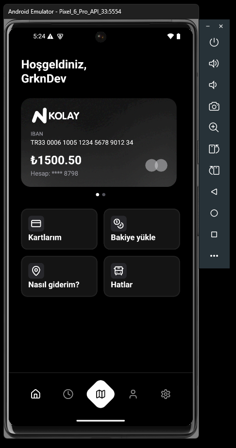
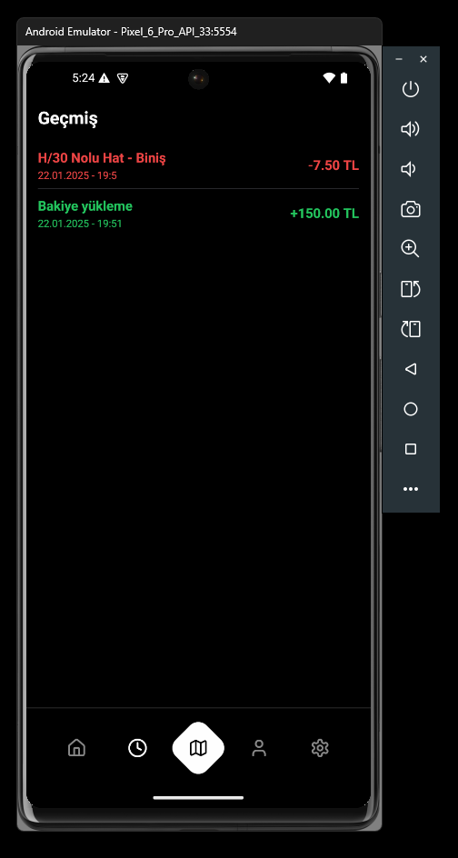
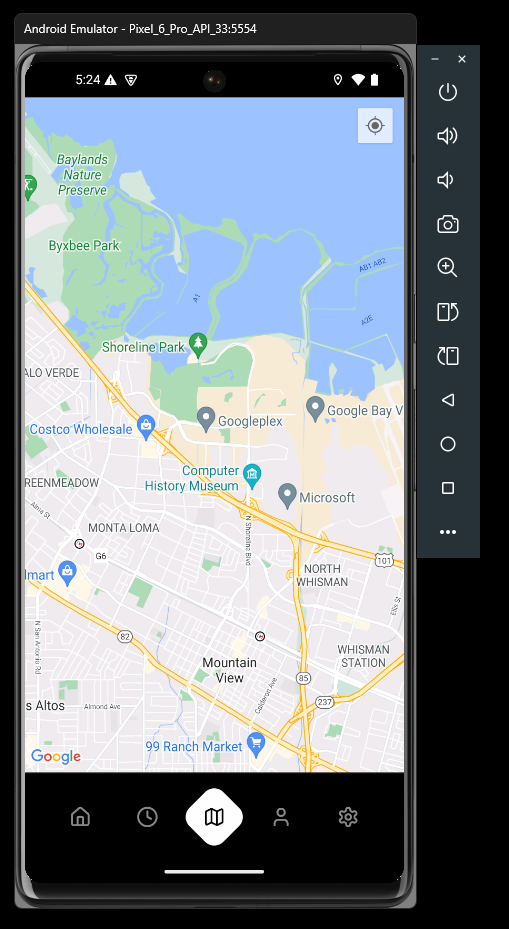
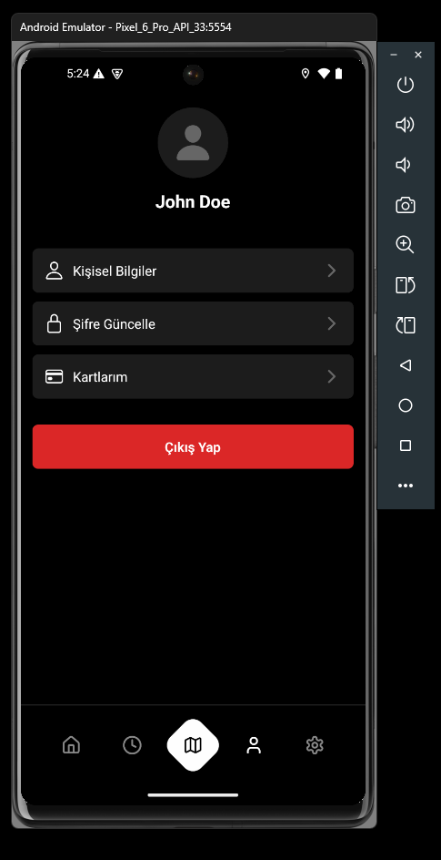
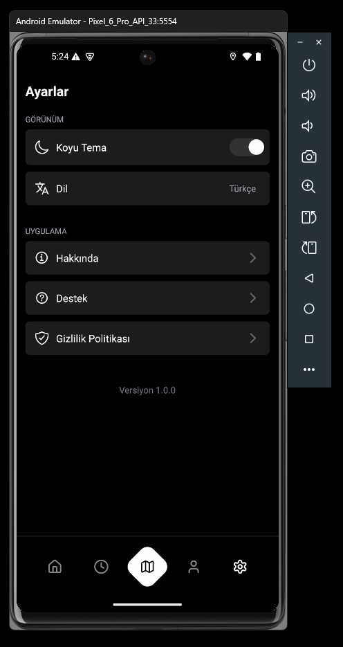

# GBus - Akıllı Otobüs Durağı Uygulaması 🚌

GBus, otobüs duraklarını ve güzergahları takip etmenizi sağlayan modern bir mobil uygulamadır. Gerçek zamanlı otobüs konumları, durak bilgileri ve rota planlaması gibi özellikleri ile toplu taşıma deneyiminizi iyileştirir.

## 📱 Uygulama Görüntüleri

<div align="center">
  
  
  
  
  
</div>

## ✨ Özellikler

- 🗺️ Gerçek zamanlı otobüs konumu takibi
- 📍 En yakın durakları bulma
- 🕒 Otobüs varış süreleri
- 📱 Kullanıcı dostu arayüz
- 🌙 Karanlık mod desteği
- 📊 Seyahat geçmişi
- ⭐ Favori durakları kaydetme
- 🔍 Durak ve hat arama
- 📲 Anlık bildirimler

## 🛠️ Teknolojiler

- React Native
- Expo
- TypeScript
- Tailwind CSS
- React Navigation
- MapView

## 🚀 Başlangıç

1. Projeyi klonlayın:
```bash
git clone https://github.com/grkndev/GBus.git
```

2. Bağımlılıkları yükleyin:
```bash
cd GBus
npm install
```

3. Uygulamayı başlatın:
```bash
npx expo start
```

## 📄 Lisans

Bu proje MIT lisansı altında lisanslanmıştır. Daha fazla bilgi için [LICENSE](LICENSE) dosyasına bakın.

## 🤝 Katkıda Bulunma

Katkılarınızı bekliyoruz! Lütfen bir pull request göndermeden önce değişikliklerinizi tartışmak için bir konu açın.

## 📞 İletişim

Sorularınız için [issues](https://github.com/grkndev/GBus/issues) bölümünü kullanabilirsiniz.
